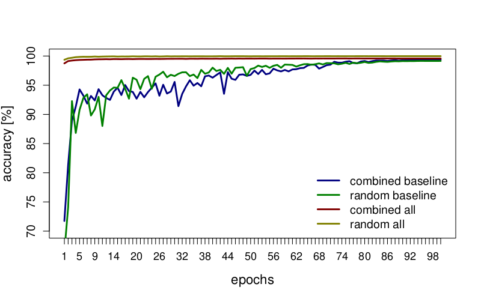

# Replication Package

For paper **Attuning Adaptation Rules via a Rule-Specific Neural Network**

This repository holds code and data required to replicate our experiments as well as additional experimental results that were not included in the paper due to limited scope. The results are in a [separate directory](results).

Also the evaluation and results discussion is [below](#evaluation).

All code files provided in this repository are experimental prototypes and should be regarded as such. They are provided AS IS with no warranties what so ever.

## 1 Coding example

In addition to the Industry 4.0 example presented in the paper, we also evaluated the approach on another example.
This one was adopted from [ReCodEx](https://github.com/recodex), a system for evaluating coding assignments being used at our university, which works as follows. Teachers prepare coding assignments that can be evaluated via automated tests. These assignments are then assigned to students who submit their solutions in the form of source code. ReCodEx compiles the solutions and executes the corresponding test suite prepared by an instructor.

For the purpose of this paper, we have selected a particular problem related to workload distribution over available resources. Since executing the tests is often computationally demanding, the ReCodEx system runs multiple evaluation services (workers) in a private cluster. When a solution is submitted by a student, a new evaluation job is created and has to be assigned to one of the workers. The strategy used for distributing the jobs potentially affects how long the student has to wait for the test grade. Not surprisingly, there is always a spike in ReCodEx load when an assignment's deadline is approaching. At this point, the cluster is overutilized, and job prioritization becomes important. The goal becomes to properly prioritize the jobs and route them to the respective workers in the cluster, such that the students do not complain too much about the ReCodEx system being slow.

In line with the rsNN method, we model the decisions in the systems using rules. For the sake of brevity, we mention here the rules categorizing the jobs into *fast* and *slow*. The fast jobs correspond to assignments that the students expect to get evaluated fast and thus they actively wait for a grade. The slow jobs correspond to assignments that are likely to take some time to get tested (e.g., tens of minutes) so the students can shift their attention to another task and resume checking for the grade later. 

To get some estimate of how long it could take to test a solution of an assignment, we use the reference solution provided by an instructor and an explicit time limit set for the test of the assignment. Additionally, we measure how long it actually takes for the solution to get tested. This gives us the following predicate deciding on whether the job is fast or slow.

```
pred isSlow(job) {
    job.refSolutionDuration > 60 || job.timeLimit > 300
}
```

However, we do not know in advance how long it will take for a specific student submission to get tested (as this depends on the quality of the submitted solution), and we also do not know what is the threshold expectation of the students&mdash;i.e., whether they wait for completion or not. Thus, the explicit thresholds (`60` and `300`) used in the rule are set using an educated guess based on previous experience.

## <a id="evaluation"></a>2 Evaluation

We evaluate our approach by comparing the training results of rsNNs created by the proposed approach with generic NNs comprising one and two dense layers. 

### 2.1 Methodology and Datasets

For the Industry 4.0 example, we created two datasets:
(a) *random* sampled dataset, which was obtained by randomly generating inputs and using the original logical formula of the guard as an oracle;
(b) *combined* dataset which combines data from a simulation and the random dataset.

The datasets were balanced in such a manner that half of the samples correspond to *true* and half to the *false* evaluation of the guard of `AccessToWorkplace`. Additionally, to obtain more representative results for evaluation, the false cases were balanced so that each combination of the top-level conjunctions outcomes (i.e., `duringShift` &amp;  `atWorkplaceGate` &amp; `hasHeadGear`) has the same probability.
 
The combined dataset combines false cases from random sampling and true cases from a simulation. The simulation was performed by a simulator we developed in the frame of an applied research project ([Trust4.0](https://github.com/smartarch/trust4.0-demo)). 
The reason for combining these two sources is to get better coverage for all possible cases when the guard of the adaptation rule evaluates to *false*.

For the code assignments example, we used anonymized job logs from the ReCodEx system. These logs were combined in a Cartesian product with all possible states of worker job queues (to express how much each worker is busy), and the training outputs were computed using a rule-based algorithm that also takes into account the supposed feedback from the users.

As the baseline generic NNs, we selected dense neural networks. Given our experiments and consultation with an expert outside our team (a researcher from another department who specializes in practical applications of neural networks), this architecture suits the problem at hand the best. Our setup comprises networks with one and two dense layers of `128` to `1024` nodes (in the case of two layers, both of them have the same amount of nodes). The dense layers use ReLU activation, and the final layer uses sigmoid.

Representing our approach, three versions of rsNNs were built corresponding to different levels of refinement. The first two models refined only the time condition: one used the `isAboveThreshold` and `isBelowThreshold` variant&mdash;denoted as "time (A&amp;B)", the other used `hasRightValue` aa-predicate&mdash;denoted as "time (right)". The last model refined all involved inputs (time, place, and headgear events) &mdash;denoted as "all". To verify the properness of logical connectives redefinition, we built a [TensorFlow](https://www.tensorflow.org/) model with no trainable weights (i.e., just rewriting the static predicates using their transformation described in the paper. By setting `p=10`, we achieved `100%` accuracy (this value of `p` was then used in all other experiments). 

All NN models were implemented in the TensorFlow machine learning framework and trained on our local GPU cluster. Each dataset was divided into the training part (`90%`) and the validation part (`10%`). We measured accuracy on the validation part only. All experiments were repeated `5x` in this evaluation we present the mean values. For the sake of brevity, we do not report on standard deviations in detail since they were very low (less than `0.1%` of accuracy in the worst case).

All training sessions used the batch size of `100` and `100` epochs. We have used the Adam optimizer with cosine decay of the learning rate. In the case of the generic NNs, we have used label smoothing to prevent overfitting (we have been experimenting with Dropout layers as well, but they were causing significant underfitting). The rsNNs did not suffer from overfitting even without label smoothing; thus, we did not apply the label smoothing in this case.


### 2.2 Results

Figure below compares the accuracy of tested generic NN configurations after `100` epochs. The greatest accuracy was observed when two `256`-node layers were used. Thus, we have selected this configuration as the baseline representative for further comparisons (we refer to this configuration simply as the "baseline"). Smaller configurations suffer from lower capacity, while larger ones have a stronger inclination to overfitting (especially in the case of the combined dataset). It is also worth mentioning that we experimented with other sizes/configurations without any improvement.

. The column labels denote widths of dense layers.")


Table below presents the measured accuracies on both datasets (random and combined) comparing rsNNs resulting from different refinements with the baseline. The last two models outperform the baseline in terms of accuracy. The *# of Weighs* line refers to the number of trainable weights in each model. While the baseline has many weights (as it features two dense layers), our rsNNs have significantly fewer weights since their composition benefits from the domain knowledge ingrained in the adaptation rules. This makes them much faster to train in order to achieve comparable accuracy levels.


|		              | baseline  | time (A\&B) | time (right) | all       | 
|--------------------------------------------------------------------------|		
| Accuracy (random)   | `99.159%` | `98.878%`   | `99.999%`    | `99.978%` |
| Accuracy (combined) | `99.393%` | `92.867%`   | `99.993%`    | `99.575%` |
| # of weights        | `68,353`  | `2`         | `21`         | `1,227`   |

Figure below shows the training speed of the models. The generic NNs are much slower in the learning process since they comprise many more trainable weights. Our rsNNs reach their peak accuracy within `10` epochs. In all cases, we observed that `100` epochs were sufficient for all models, so we have used this as the limit.



A detailed description of the rsNN experiments targeting the Coding Assignments example is provided below.

### 2.3 Limitations&mdash;Threats to Validity

Though we did our best given the limited scope of the paper, we are aware of several threats to the validity of our evaluation. Nevertheless, we believe the evaluation still provides a valuable insight into the potential of the rsNN method.

The threats to validity are presented below based on the schema in [[1]](#ref1), where the validity classes are defined as follows:
 - construct validity,
 - internal validity,
 - external validity, and
 - reliability.

**Construct validity:** There is a danger that we devised our evaluation wrongly. As a metric, we consider the accuracy achieved by rsNN and compare it with a generic neural network, which we chose as the baseline. This way, we show that rsNN does not underperform, even though it uses substantially fewer training weights (being thus more robust) and trains faster. We believe this metric is adequate for supporting the argument on the benefit of rsNN we articulate in the conclusion of the paper.

**Internal validity:** There is a possible danger that the employed generic neural network was trained as a black box. 
Therefore, the reported improvements exhibited by rsNNs might not result from the proposed rsNN method but rather from a hidden factor that we are not aware of.
Nevertheless, we aim to mitigate it by using exactly the same inputs and training procedure when training and evaluating the baseline generic NNs and rsNNs.

**External validity:** Given the limited scope of the paper, we demonstrated rsNN on two adaptation rules only (i.e., `AccessToWorkplace` and `isSlow`). We chose these rules because they showcase the combination of multiple concerns (time, position, event history, and user preference). However, we are aware of the fact that a larger case study would be needed to identify a richer set of the types of aa-predicates. Also, the limited complexity of the predicate does not allow to fully test the limits of what can be learned by an rsNN. We tried to mitigate this problem to a certain extent by creating additional experiments with synthetically built guards (featuring, e.g., a conjunction of more than three aa-predicates). To illustrate the potential fields of application of the rsNN method, we also evaluated it on two use-cases from significantly different domains. It is worth noting that the Coding Assignment example stems from an existing system used in our Comp.Sci. departments on a daily basis. Thus, the data for evaluation were taken from a "production environment".
 
**Reliability:** Another threat to validity is that we constructed the baseline generic NNs on our own. To help reduce the potential bias here, we consulted an expert outside of our team to select the best possible generic NN architecture fitting the nature of the data. Moreover, we performed an automated hyperparameter tuning to help us identify the best generic NN architecture eventually used as the baseline.


## 3 Data

For the **Industry 4.0 example**, we provide four [datasets](data): The `combined` and `random` datasets for the `industry` use case (explained in the paper) and two synthetic datasets `c5` and `c10` -- representing 5 and 10 parameters respectively for conjunction formula.

The dataset are in `.hdf5` format which can be directly used by our training scripts. Each dataset is accompanied by a `.json` file which holds the metadata (the file is not necessary, we provide it only for illustration).

The example from **ReCodEx system for evaluation of coding assignments** uses data collected from the logs of our instance. The [abcde-solutions.csv](data/abcde-solutions.csv) holds raw metadata of all submitted jobs (please note it was gziped), [abcde-ref-solutions.csv](data/abcde-ref-solutions.csv) contains reference solutions that can be used to estimate duration of new incoming jobs.

The `abcde-preprocess.py` script parses the CSV files and generate a `.hdf5` file for the machine learning process. It randomly selects three sets of jobs:
* jobs that are slow
* jobs that are not slow but could have been identified as such
* fast jobs
All three sets are selected to have the same size.

Job logs are combined in cartesian product with possible queue states. The emulated configuration uses 4 queues, the first one is dedicated for slow jobs and the remaining three are for fast jobs (slow queue can accept fast jobs if idle, but fast queues must not be blocked by slow jobs as it will jeopardize the latency). The queue state is represented by four float numbers between 0 and 1 (to be ready for ML processing), 0 denotes empty queue, 1 is currently the most full queue of the system.

The outputs are computed using algorithm you can find in `compute_output` function of the `abcde-preprocess.py` script.

The `.hdf5` file with default arguments is generated as follows:
```
$> ./abcde-preprocess.py --refs ./data/abcde-ref-solutions.csv ./data/abcde-solutions.csv ./data/abcde.hdf5
```

Both datasets are divided into two parts -- training set and testing set. The testing set has approximately `10%` the size of the training set.


## 4 Training the Industry 4.0 Models

**Prerequisites:** You will require Python 3.6+ and [Tensorflow framework](https://www.tensorflow.org/install) installed.

For your convenience, we have assembled the code into two files.

* `dense.py` - trains the baseline dense neural network models
* `custom.py` - trains the custom neural networks

Both files just print out the accuracies measured after every epoch in CSV format, so we could use them for subsequent analysis. Please note that running evaluation of validation data after every epoch is not common procedure. These results should not be used to determine the number of epochs. However, our objective was not to train usable model, but rather to explore the behavior of the training process itself.

**Utilization:**

The `dense.py` receives only the following arguments. The first argument is input data set in `.hdf5` format (that comprise both training and validation data). It is followed by any number of integers, each one represents number of nodes in a dense layer (i.e., providing `128 256` will create two dense layers, first one of 128 nodes and the second one of 256 nodes). The dense network training could be used for industrial example data as well as synthetic data (as they differ only in the number of properties and the neural network model will adapt to that automatically).

To train the model which worked the best for us simply execute
```
$> python dense.py datafile.hdf5 128 128
```

The `custom.py` uses more elaborate CLI arguments (see the code itself for a complete list). After named arguments (options), the script takes one unnamed argument -- the name of the input data file (`.hdf5`, same as the previous script). Most of the arguments have their defaults already set to optimal values.

For the industry data sample (both combined and random), add `--model industry` parameter. For synthetic models add `--model synth`. We also recommend to use `--verbose` when executing the script directly on console.

To train (relax) all three possible inputs (time, position, and head gear events) use the defaults:
```
$> python custom.py --verbose --model industry datafile.hdf5
```

To train (relax) only the time (position and head gear events are evaluated as strict logical formulas), set capacity of place and event sub-models to zero:
```
$> python custom.py --verbose --model industry --place_capacity 0 --event_capacity 0 datafile.hdf5
```

The time sub-model can be switched into simple above & below thresholds thusly:
```
$> python custom.py --verbose --model industry --place_capacity 0 --event_capacity 0 --time_above_below datafile.hdf5
```

These three configurations were presented in the paper. Additionally, we have trained the synthetic formulas:

```
$> python custom.py --verbose --model synth synthfile.hdf5
```

## Training the ReCodEx Models

The preprocessed input (using the default arguments) is composed of features from 3 domains:


* Five class identifiers, each represented as a normalized number 1..N (N is different for each class). These classes are internally transformed into hot-one encoding:
	* course ID
	* assignments ID
	* runtime ID (name of the programming language used for the solution)
	* additional identification that implies the capabilities of the worker service (e.g., installed libraries)
	* ID of a user that created the submission
* Regular numeric inputs (which are normalized to 0-1 range):
	* maximal time limit for the job (loaded from assignment configuration for the particular runtime)
	* bool flag, whether the limit is for CPU time or wall time
	* duration of the evaluation of the corresponding reference solution
* And four inputs representing the states of the queues which are already normalized (these were explained in the data preprocessing).

The outputs are saved as probabilistic distribution of a classification problem (i.e., 4 floats as we have 4 worker queues).

Once you have the preprocessed `.hdf5` file, simply execute
```
$> abcde.py ./data/abcde.hdf5 <hidden-layer-width>
```
for the baseline model and
```
$> abcde.py ./data/abcde.hdf5 custom <hidden-layer-width>
```
for our custom model. The width of the hidden layer is configurable, even rather small values like 64 should be enough as the inputs are extremely wide (in hot-one encoding), so there are enough trainable parameters between the input layer and hidden layer.

Both models should get to approximately the same accuracy, which proves our modification does not alter the training capacity.

## References

<a id="ref1">[1]</a> Per Runeson and Martin Höst. Guidelines for conducting and reporting
case study research in software engineering. Empirical Software Engineering 14,
2 (April 2009), 131–164. https://doi.org/10.1007/s10664-008-9102-8


